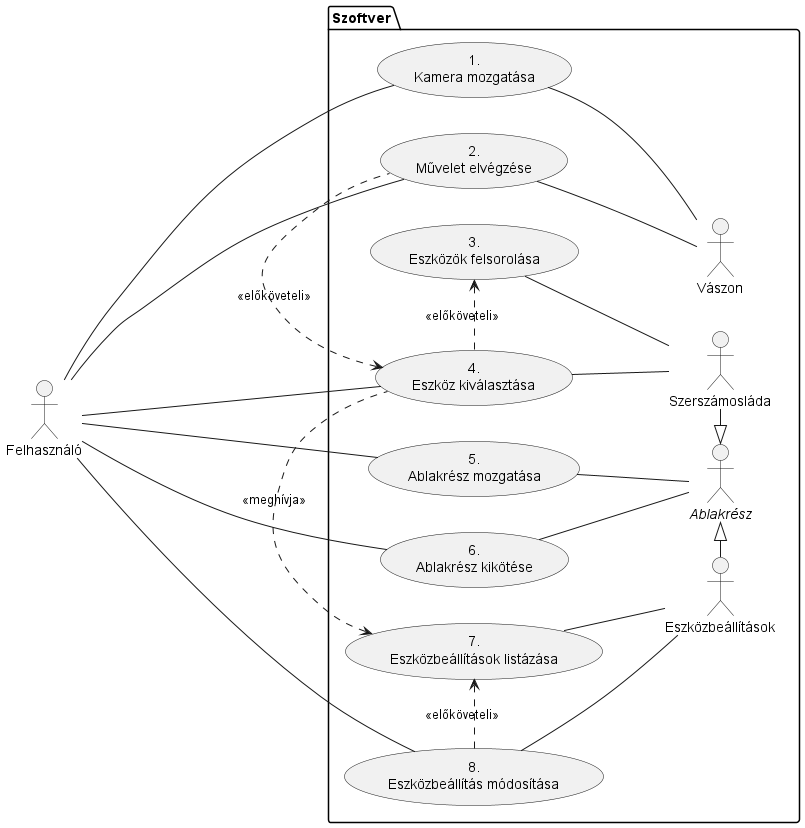
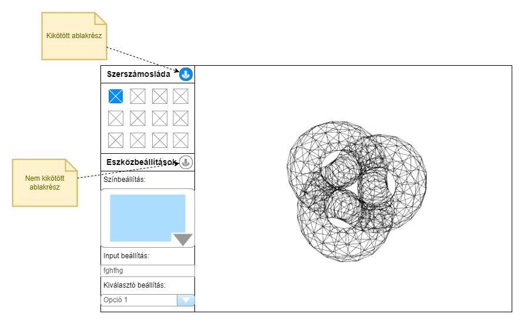
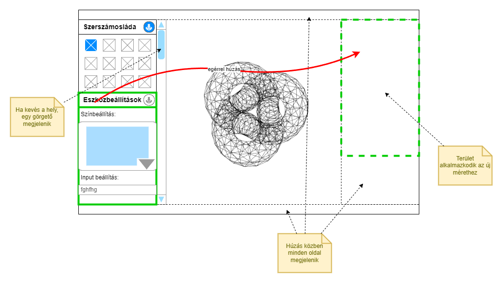

# Tervezői dokumentáció

## Hivatkozások:

- **User Story issue**: #1
- **Fejlesztői megjegyzések**: [link](./dev_notes.md)
- **Tesztesetek, elvégzett tesztek**: [link](./tests.md)

## Használati esetek

| UC azonosító            | UC0001.1.1                                                                                                                                                                                                                                                                                                                                                                                   |
| ----------------------- | -------------------------------------------------------------------------------------------------------------------------------------------------------------------------------------------------------------------------------------------------------------------------------------------------------------------------------------------------------------------------------------------- |
| UC neve                 | Kamera mozgatása                                                                                                                                                                                                                                                                                                                                                                             |
| Szereplők               | Felhasználó, Vászon                                                                                                                                                                                                                                                                                                                                                                          |
| Bekövetkezés            | A felhasználó más szemszögből szeretné megtekinteni a vászonon lévő modellt.                                                                                                                                                                                                                                                                                                                 |
| Előkövetelmények        |                                                                                                                                                                                                                                                                                                                                                                                              |
| Utókövetelmények        |                                                                                                                                                                                                                                                                                                                                                                                              |
| Folyamat                | 1. A felhasználó ráviszi a mutatóját a vászonra.  2. A felhasználó görgeti az egeret, vagy lenyomva tartja a középső egérgombot.  3. A kamera elhelyezkedése változik a vásznon.                                                                                                                                                                                                       |
| Alternatívák, kivételek | 2A.1. A felhasználó görget.  2A.1.1. A kamera előre/hátra megy.    2A.2. A felhasználó a Ctrl billentyűt tartva görget.  2A.2.1. A kamera látószöge módosul.    2A.3. A felhasználó mozgatja az egeret.  2A.3.1. A kamera iránya változik.    2A.4. A felhasználó a Ctrl billentyűt tartva mozgatja az egeret.  2A.4.1. A kamera az egérmozgás irányába mozog. |
| Speciális követelmények |                                                                                                                                                                                                                                                                                                                                                                                              |
| Megjegyzések            |                                                                                                                                                                                                                                                                                                                                                                                              |

| UC azonosító            | UC0001.1.2                                                                                                                                                                                                  |
| ----------------------- | ----------------------------------------------------------------------------------------------------------------------------------------------------------------------------------------------------------- |
| UC neve                 | Művelet elvégzése                                                                                                                                                                                           |
| Szereplők               | Felhasználó, Vászon                                                                                                                                                                                         |
| Bekövetkezés            | A felhasználó alkalmazni szeretné a modellen a kiválasztott eszközhöz tartozó műveletet.                                                                                                                    |
| Előkövetelmények        | 1. Egy eszköz ki van választva _(UC0001.1.4)_                                                                                                                                                               |
| Utókövetelmények        |                                                                                                                                                                                                             |
| Folyamat                | 1. A felhasználó ráviszi az egerét a vászonra.  2. A felhasználó megnyomja a bal-, vagy a jobb egérgombot.  3. A kiválasztott eszközhöz, illetve a megnyomott egérgombhoz tartozó művelet elvégződik. |
| Alternatívák, kivételek |                                                                                                                                                                                                             |
| Speciális követelmények | 1. A műveletnek gyorsnak kell lennie, a módosítás legyen valós időben látható.                                                                                                                              |
| Megjegyzések            |                                                                                                                                                                                                             |

| UC azonosító            | UC0001.1.3                                                                                         |
| ----------------------- | -------------------------------------------------------------------------------------------------- |
| UC neve                 | Eszközök felsorolása                                                                               |
| Szereplők               | Szerszámosláda                                                                                     |
| Bekövetkezés            | A szerszámosláda megjelenne a képernyőn.                                                           |
| Előkövetelmények        |                                                                                                    |
| Utókövetelmények        |                                                                                                    |
| Folyamat                | 1. Az elérhető eszközök felsorolásra kerülnek.  2. Az eszközök megjelennek a szerszámosládában. |
| Alternatívák, kivételek |                                                                                                    |
| Speciális követelmények |                                                                                                    |
| Megjegyzések            |                                                                                                    |

| UC azonosító            | UC0001.1.4                                                                                                                                                                   |
| ----------------------- | ---------------------------------------------------------------------------------------------------------------------------------------------------------------------------- |
| UC neve                 | Eszköz kiválasztása                                                                                                                                                          |
| Szereplők               | Felhasználó, Szerszámosláda                                                                                                                                                  |
| Bekövetkezés            | A felhasználó ki szeretné választani az éppen szükségre szoruló eszközt.                                                                                                     |
| Előkövetelmények        | 1. Az eszközök felsorolásra kerültek. _(UC0001.1.3)_                                                                                                                         |
| Utókövetelmények        |                                                                                                                                                                              |
| Folyamat                | 1. A felhasználó rákattint a neki éppen szükséges eszközre. 2. Az eszköz kiválasztásra kerül. 3. A kiválasztott eszköz beállításai listázásra kerülnek. _(UC0001.1.7)_ |
| Alternatívák, kivételek |                                                                                                                                                                              |
| Speciális követelmények | 1. A kiválasztott eszköz jelenjen meg eltérő módon a többi eszközhöz képest.                                                                                                 |
| Megjegyzések            |                                                                                                                                                                              |

| UC azonosító            | UC0001.1.5                                                                                                                                                                                                                                                                             |
| ----------------------- | -------------------------------------------------------------------------------------------------------------------------------------------------------------------------------------------------------------------------------------------------------------------------------------- |
| UC neve                 | Ablakrész mozgatása                                                                                                                                                                                                                                                                    |
| Szereplők               | Felhasználó, Ablakrész                                                                                                                                                                                                                                                                 |
| Bekövetkezés            | A felhasználó máshova szeretne mozgatni egy adott ablakrészt.                                                                                                                                                                                                                          |
| Előkövetelmények        | 1. A húzandó ablakrész jelenleg nincsen kikötve.                                                                                                                                                                                                                                       |
| Utókövetelmények        |                                                                                                                                                                                                                                                                                        |
| Folyamat                | 1. A felhasználó ráviszi az egeret a húzandó ablakrész fejlécére.  2. A felhasználó lenyomva tartja a bal egérgombot.  3. A felhasználó elhúzza az ablakrészt a vászon egy másik oldalára, majd elengedi a bal egérgombot.  4. Az ablakrész új helyen jelenik meg.            |
| Alternatívák, kivételek |                                                                                                                                                                                                                                                                                        |
| Speciális követelmények | 1. A vászon egy oldalára egynél több ablakrészt is lehessen rakni.  2. Ha az ablakrészek sok helyet vesznek el az oldalból, az adott rész legyen görgethető.  3. Amikor az ablakrész egy vászon oldalához ér, ennek legyen egy grafikus jelzése (pl. szaggatott vonalú négyzet). |
| Megjegyzések            |                                                                                                                                                                                                                                                                                        |

| UC azonosító            | UC0001.1.6                                                                                                                                                                            |
| ----------------------- | ------------------------------------------------------------------------------------------------------------------------------------------------------------------------------------- |
| UC neve                 | Ablakrész kikötése                                                                                                                                                                    |
| Szereplők               | Felhasználó, _Ablakrész_                                                                                                                                                              |
| Bekövetkezés            | A felhasználó szeretné megakadályozni az ablakrész mozgatását.                                                                                                                        |
| Előkövetelmények        |                                                                                                                                                                                       |
| Utókövetelmények        |                                                                                                                                                                                       |
| Folyamat                | 1. A felhasználó ráviszi az egeret a kikötendő ablakrész horgony gombjára, majd rákattint.  2. A horgony gomb "lenyomottként" jelenik meg, és az ablakrész mozgathatatlanná válik. |
| Alternatívák, kivételek | 2A.1. Az ablakrész már ki van kötve.  2A.1.1. A horgony gomb felengedve jelenik meg, és az ablakrész újból mozgathatóvá válik.                                                     |
| Speciális követelmények |                                                                                                                                                                                       |
| Megjegyzések            | "Lenyomott" alatt a gomb besüllyedt megjelenését kell érteni.                                                                                                                         |

| UC azonosító            | UC0001.1.7                                                                                                                                       |
| ----------------------- | ------------------------------------------------------------------------------------------------------------------------------------------------ |
| UC neve                 | Eszközbeállítások listázása                                                                                                                      |
| Szereplők               | Eszközbeállítások                                                                                                                                |
| Bekövetkezés            | Egy másik eszköz kiválasztásra kerül.                                                                                                            |
| Előkövetelmények        | 1. Egy eszköznek kiválasztásra kell kerülnie. _(UC0001.1.4)_                                                                                     |
| Utókövetelmények        |                                                                                                                                                  |
| Folyamat                | 1. Az elérhető eszközbeállítások felsorolásra kerülnek.  2. Az eszközbeállítások megjelennek az ablakrészben.                                 |
| Alternatívák, kivételek | 2A.1. Nincs még kiválasztva eszköz, vagy az eszközhöz nem tartozik egyetlen beállítás sem.  2A.1.1. A beállítások helyén "(nincs)" íródik ki. |
| Speciális követelmények |                                                                                                                                                  |
| Megjegyzések            |                                                                                                                                                  |

| UC azonosító            | UC0001.1.8                                                                                                                                                                                                                      |
| ----------------------- | ------------------------------------------------------------------------------------------------------------------------------------------------------------------------------------------------------------------------------- |
| UC neve                 | Eszközbeállítás módosítása                                                                                                                                                                                                      |
| Szereplők               | Felhasználó, Eszközbeállítások                                                                                                                                                                                                  |
| Bekövetkezés            | A felhasználó szeretné módosítani a kiválasztott eszköz egyik tulajdonságát.                                                                                                                                                    |
| Előkövetelmények        | 1. Az eszközbeállítások felsorolásra kerültek. _(UC0001.1.7)_                                                                                                                                                                   |
| Utókövetelmények        |                                                                                                                                                                                                                                 |
| Folyamat                | 1. A felhasználó ráviszi az egeret a beállításhoz tartozó bemenetre (mező, színskála stb.).  2. A felhasználó módosítja a bemenetet a neki szükséges értékre.  3. A kiválasztott eszköz az új beállításokkal fog működni. |
| Alternatívák, kivételek |                                                                                                                                                                                                                                 |
| Speciális követelmények |                                                                                                                                                                                                                                 |
| Megjegyzések            |                                                                                                                                                                                                                                 |

## Képernyőtervek

### A vászon és az ablakrészek

### Ablakrész mozgatása

